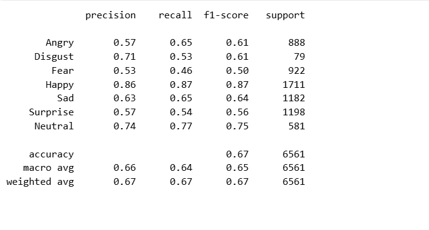

# 😊 Emotion Recognition Platform using Deep Learning


A real-time **Facial Emotion Recognition Platform** developed using **PyTorch**, **OpenCV**, and **Streamlit**. The application detects human faces from uploaded images or a webcam feed and predicts one of seven facial emotions using a custom Convolutional Neural Network (CNN) trained on the FER2013 dataset.

---

## 📌 Features

- 🎭 Detects **7 facial emotions**
- 📷 Upload image for emotion prediction
- 🎥 Real-time webcam emotion detection
- 🧠 Custom CNN built using PyTorch
- ⚡ Interactive Streamlit web application
- 😊 Face detection using Haar Cascade
- 📊 Model evaluation with Classification Report and Confusion Matrix

---

## 🧠 Emotions Detected

- Angry 😠
- Disgust 🤢
- Fear 😨
- Happy 😊
- Sad 😢
- Surprise 😲
- Neutral 😐

---

## 🛠️ Tech Stack

| Category             | Technologies  |
| -------------------- | ------------- |
| Programming Language | Python        |
| Deep Learning        | PyTorch       |
| Computer Vision      | OpenCV        |
| Web Framework        | Streamlit     |
| Data Processing      | NumPy, Pandas |
| Visualization        | Matplotlib    |
| Dataset              | FER2013       |

---

## 📂 Project Structure

```
Emotion-Recognition-Platform/
│
├── app.py
├── model.py
├── best_model.pth
├── requirements.txt
├── README.md
│
├── notebooks/
│   ├── Data_transformation.ipynb
│   ├── Model_Building.ipynb
│   └── Image_face_checker.ipynb
│
├── assets/
│   ├── homepage.png
│   ├── webcam_demo.png
│   ├── confusion_matrix.png
│   ├── accuracy_curve.png
│   └── loss_curve.png
│
```

---

## 🏗️ CNN Architecture

The model consists of:

- 3 Convolution Blocks
- Batch Normalization
- ReLU Activation
- Max Pooling
- Dropout Layers
- Adaptive Average Pooling
- Fully Connected Classifier

Architecture Summary:

```
Input (1 × 48 × 48)
        │
Conv2D (64)
        │
Conv2D (64)
        │
MaxPool
        │
Dropout
        │
Conv2D (128)
        │
Conv2D (128)
        │
MaxPool
        │
Dropout
        │
Conv2D (256)
        │
Conv2D (256)
        │
MaxPool
        │
Dropout
        │
Adaptive Average Pooling
        │
Fully Connected (256)
        │
Output (7 Classes)
```

---

## 📊 Model Performance

### Dataset

FER2013

### Training Accuracy

**93%**

### Validation Accuracy

**67%**

### Classification Report

| Emotion  | Precision | Recall | F1-Score |
| -------- | --------: | -----: | -------: |
| Angry    |      0.57 |   0.65 |     0.61 |
| Disgust  |      0.71 |   0.53 |     0.61 |
| Fear     |      0.53 |   0.46 |     0.50 |
| Happy    |      0.86 |   0.87 |     0.87 |
| Sad      |      0.63 |   0.65 |     0.64 |
| Surprise |      0.57 |   0.54 |     0.56 |
| Neutral  |      0.74 |   0.77 |     0.75 |

**Overall Validation Accuracy:** **67%**

---


### Home Page


---

### Webcam Prediction


---

### Confusion Matrix



---

### Accuracy Curve


---

## 🚀 Installation

Clone the repository

```bash
git clone https://github.com/yourusername/Emotion-Recognition-Platform.git
```

Move into the project folder

```bash
cd Emotion-Recognition-Platform
```

Install dependencies

```bash
pip install -r requirements.txt
```

Run the application

```bash
streamlit run app.py
```

---

## 📦 Dataset

This project uses the **FER2013** facial emotion recognition dataset.

Due to GitHub file size limitations, the dataset is **not included** in this repository.

Download the dataset from Kaggle:

https://www.kaggle.com/datasets/msambare/fer2013

After downloading, organize it as:

```
preprocessed_images/
    train/
    validation/
```

---

## 🎯 Future Improvements

- Improve validation accuracy using transfer learning
- Deploy using Docker
- Add Grad-CAM visualization
- Support multiple face detection
- Mobile application deployment
- Cloud deployment on AWS/GCP

---

## 👨‍💻 Author

**Rohit Kshirsagar**

- GitHub: https://github.com/yourusername
- LinkedIn: https://linkedin.com/in/yourprofile

---

## ⭐ If you like this project

Please consider giving this repository a ⭐ on GitHub.

It motivates me to build more Machine Learning and Computer Vision projects.
